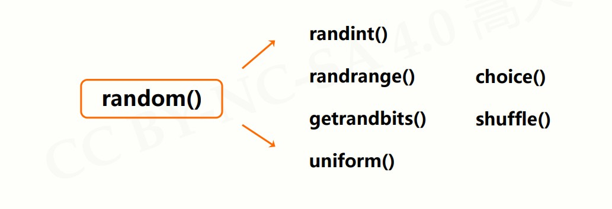

# 模块3：random库

[random库文档](https://docs.python.org/3/library/random.html)

## random库概述

`random` 库是使用随机数的Python**标准库**。

- 伪随机数：采用**梅森旋转算法**生成的伪随机数序列中的元素
- random库主要用于生成随机数


| 分类           | 函数                                                         |
| -------------- | ------------------------------------------------------------ |
| 基本随机数函数 | seed() / random()                                            |
| 扩展随机数函数 | `randint()` / `getrandbits()` / `uniform()` / `randrange()` / `choice()` / `shuffle()` |


## 基本随机数函数

#### seed()

初始化给定的随机数种子，默认为当前系统时间

```python
import random
random.seed(10)
#产生种子10对应的序列
```


#### random()

生成一个 [0.0 , 1.0] 之间的随机小数

```
import random
random.seed(10)
random.random()
```


## 扩展随机数函数



#### `randint(a, b)`

生成一个 [a,b] 之间的整数

```python
import random
random.randint(10, 100)
```


#### `randrange(m, n[, k])`

生成一个 [m, n) 之间以k为步长的随机整数

```python
random.randrange(10, 100, 10)
```


#### `getrandbits(k)`

生成一个k比特长的随机整数

```python
import random
random.getrandbits(16)
```


#### `uniform(a, b)`

生成一个 [a,b] 之间的随机小数

```python
import random
random.uniform(10, 100)
```


#### `choice(seq)`

从序列 `seq` 中随机选择一个元素

```python
import random
random.choice([1,2,3,4,5,6,7,8,9])
```


## 随机数函数的使用

- 能够利用随机数种子产生“确定”伪随机数
- 能够产生随机整数
- 能够对序列类型进行随机操作