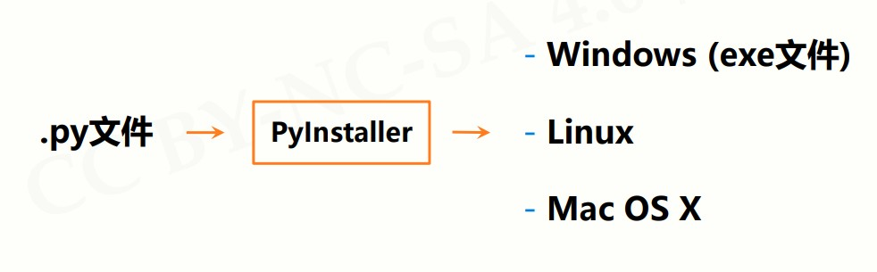

# 模块4：PyInstaller库

[PyInstaller库文档](https://pypi.org/project/pyinstaller/)


## `PyInstaller`库概述

`PyInstaller` 库是**第三方库**。（安装第三方库需要使用 `pip` 工具）

将 `.py` 源代码转换成无需源代码的可执行文件。



### 安装

cmd 命令行，执行：

```python
python -m pip install pyinstaller
```


## 使用

### 简单使用

`cmd` 命令行，执行：

```python
#pyinstaller -F <文件名.py>
```


### 常用参数

| 参数                | 描述                                 |
| ------------------- | ------------------------------------ |
| -h                  | 查看帮助                             |
| --clean             | 清理打包过程中的临时文件             |
| -D, --onedir        | 默认值，生成 dist 文件夹             |
| -F, --onefile       | 在 dist 文件夹中只生成独立的打包文件 |
| -i <图标文件名.ico> | 指定打包程序使用的图标（icon）文件   |


### 示例

```python
pyinstaller -i curve.ico -F SevenDigitsDrawV2.py
```


