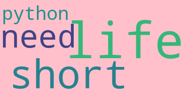

# 模块6：wordcloud库

[wordcloud库文档](https://amueller.github.io/word_cloud/)

## wordcloud库概述

优秀的词云展示**第三方库**。（需要pip安装）

词云以词语为基本单位，更加直观和艺术地展示文本。


### 安装

cmd命令行，执行：

```python
python -m pip install wordcloud
```


## 基本使用

wordcloud库把词云当作一个WordCloud对象。


### 分词原理

- **分隔**：以空格分隔单词
- **统计**：单词出现次数并过滤
- **字体**：根据统计配置字号
- **布局**：颜色环境尺寸


### WordCloud对象

wordcloud.WordCloud() 代表一个文本对应的词云。

可以根据文本中词语出现的频率等参数绘制词云。

词云的绘制形状、尺寸和颜色都可以设定。

```python
w = wordcloud.WordCloud()

#以WordCloud对象为基础
#配置参数、加载文本、输出文件
```


### 常规方法

#### 加载文本

```python
#w.generate(txt)
```

#### 输出图像文件

```python
#w.to_file(filename)
#.png或.jpg格式
```

示例：

```python
import wordcloud

#配置对象参数
w = wordcloud.WordCloud()
#加载词云文件
w.generate("wordcloud by Python")
#输出词云文件
w.to_file("pywordcloud.png")
```


### 配置对象参数

```python
#w = wordcloud.WordCloud(<参数>)
```

| 参数             | 说明                                                   |
| ---------------- | ------------------------------------------------------ |
| width            | 指定词云对象生成图片的宽度，默认400像素                |
| height           | 指定词云对象生成图片的高度，默认200像素                |
| min_font_size    | 指定词云中字体的最小字号，默认4号                      |
| max_font_size    | 指定词云中字体的最大字号，根据高度自动调节             |
| font_step        | 指定词云中字体字号的步进间隔，默认为1                  |
| font_path        | 指定字体文件的默认路径，默认为None                     |
| max_words        | 指定词云显示的最大单词数量，默认200                    |
| stop_words       | 指定词云的排除词列表，即不显示的单词列表               |
| mask             | 指定词云的形状，默认为长方形，需要引用 `imread()` 函数 |
| background_color | 指定词云图片的背景颜色，默认为黑色                     |


### 实例

```python
import wordcloud
txt = "life is short, you need python"
w = wordcloud.WordCloud(background_color = "pink")
w.generate(txt)
w.to_file("pywcloud.png")
```




```python
import jieba
import wordcloud
txt = "程序设计语言是计算机能够理解和识别用户操作意图的一种交互体系，它按照特定规则组织计算机指令，使计算机能够自动进行各种运算处理。"
w = wordcloud.WordCloud(width = 1000, font_path="msyh.ttc", height = 700)
w.generate(" ".join(jieba.lcut(txt)))
w.to_file("pywcloud2.png")
```


