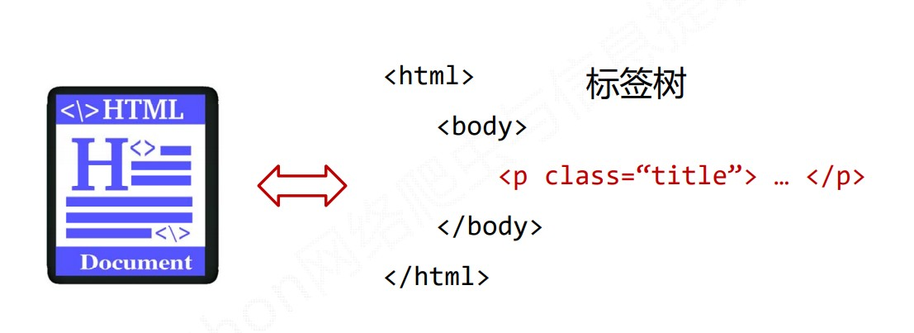
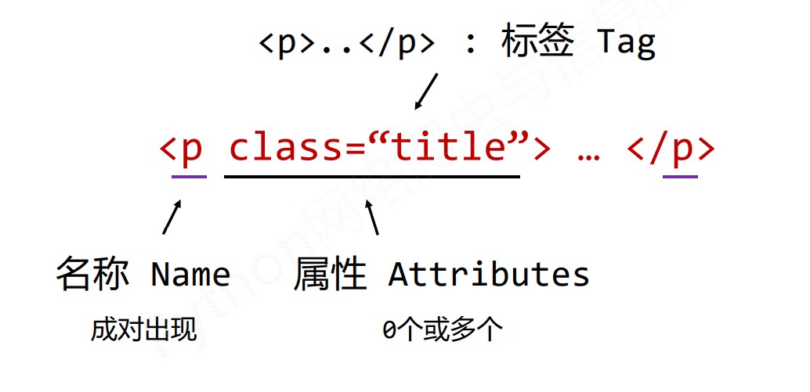
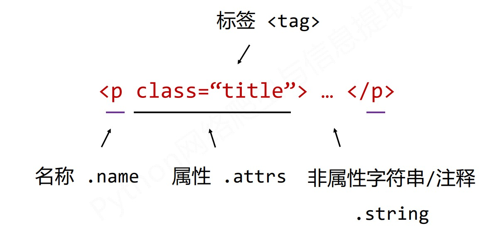
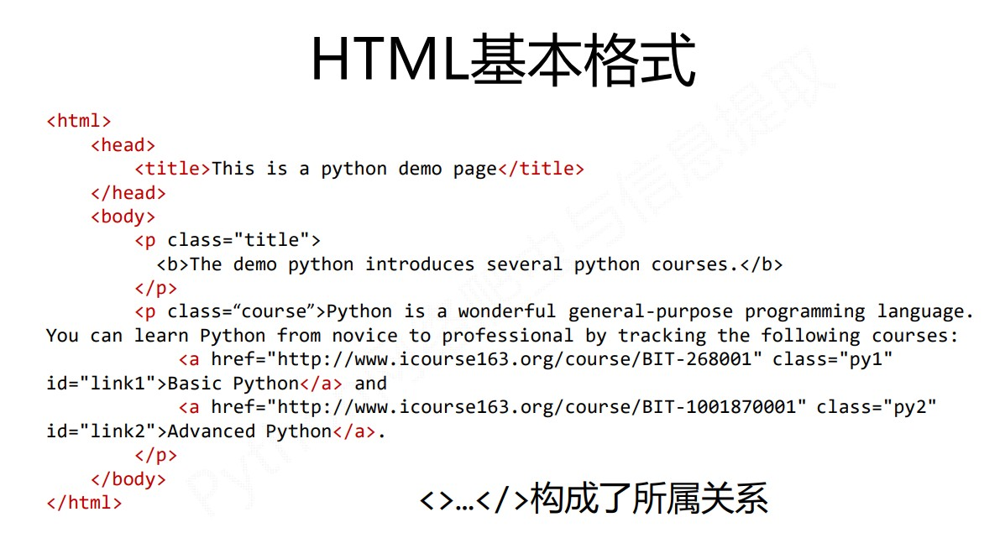
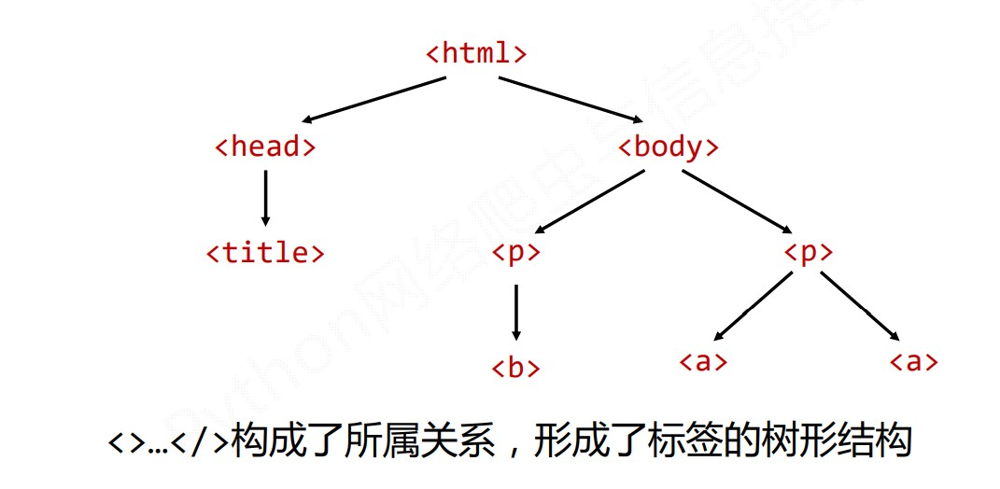
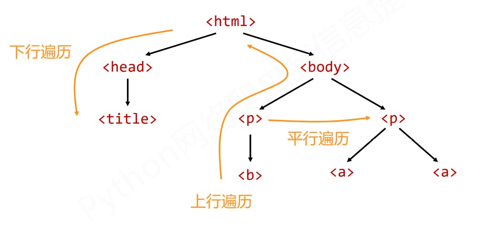
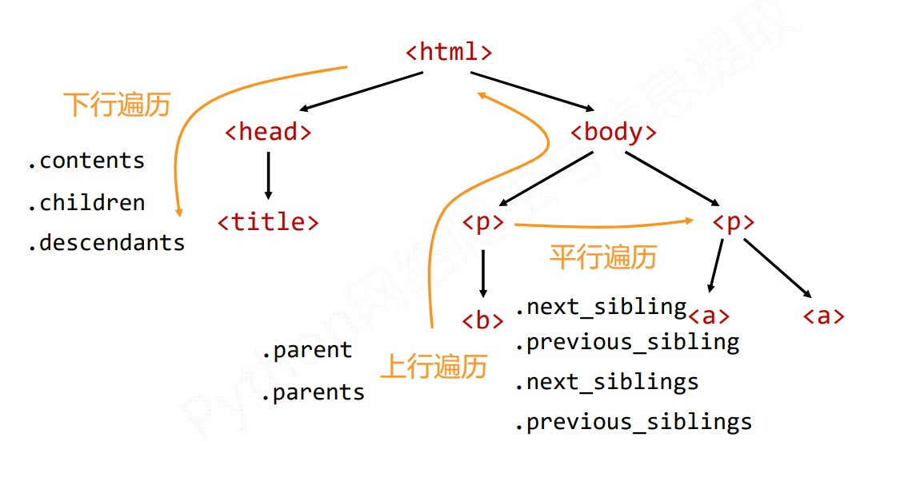

# `BeautifulSoup`库

[BeautifulSoup库文档](https://www.crummy.com/software/BeautifulSoup/bs4/doc/)

## 简介

`BeautifulSoup` 库是解析、遍历、维护 “标签树” 的功能库。






## 安装

`cmd` 命令行，执行

```python
python -m pip install beautifulsoup4
```


安装测试：

```python
import requests
from bs4 import BeautifulSoup

r = requests.get(http://python123.io/ws/demo.html)
r.text
demo = r.text

soup = BeautifulSoup(demo, 'html.parser')
print(soup.prettify)
```


## 库的引用

```python
from bs4 import BeautifulSoup
#import bs4
```


## 解析器

```python
soup = BeautifulSoup('<html>data</html>', 'html.parser')
#'html.parser' 即为解析器可选参数
```


| 解析器             | 使用方法                                            | 条件                 |
| ------------------ | --------------------------------------------------- | -------------------- |
| bs4的HTML解析器    | `BeautifulSoup('<html>data</html>', 'html.parser')` | 安装bs4库            |
| `lxml`的HTML解析器 | `BeautifulSoup('<html>data</html>', 'lxml')`        | `pip install lxml`   |
| `lxml`的XML解析器  | `BeautifulSoup('<html>data</html>', 'xml')`         | `pip install lxml`   |
| html5lib的解析器   | `BeautifulSoup('<html>data</html>', 'html5lib')`    | pip install html5lib |


## `BeautifulSoup` 类

`BeautifulSoup` 对应一个 HTML/XML 文档的全部内容。


### 基本元素



| 基本标签          | 说明                                                         |
| ----------------- | ------------------------------------------------------------ |
| `Tag`             | 标签，最基本的信息组织单元，分别用 <> 和 </> 标明开头和结尾。 |
| `Name`            | 标签的名字，格式：`<tag>.name`                               |
| `Attributes`      | 标签的属性，字典形式组织，格式：`<tag>.attrs`                |
| `NavigableString` | 标签内非属性字符串，格式：`<tag>.string`                     |
| `Comment`         | 标签内字符串的注释部分，一种特殊的Comment类型                |


#### Tag 标签

> 标签，最基本的信息组织单元，分别用 <> 和 </> 标明开头和结尾。

```python
from bs4 import BeautifulSoup
soup = BeautifulSoup(demo, "html.parser")
soup.title
tag = soup.a
tag
```

任何存在于 HTML 语法中的标签都可以用 `soup.<tag>` 访问获得。

当 HTML 文档中存在多个相同 `<tag>` 对应内容时，返回第一个。


#### Name

> 标签的名字，格式：`<tag>.name`

```python
from bs4 import BeautifulSoup
soup = BeautifulSoup(demo, "html.parser")
soup.a.name
soup.a.parent.name
soup.a.parent.parent.name
```

每个 `<tag>` 都有自己的名字，通过 `<tag>.name` 获取，字符串类型。


#### Attributes

> 标签的属性，字典形式组织，格式：`<tag>.attrs`

```python
from bs4 import BeautifulSoup
soup = BeautifulSoup(demo, "html.parser")
tag = soup.a
tag.attrs
tag.attrs['class']
type(tag.attrs)
type(tag)
```

一个`<tag>`可以有0个或多个属性，字典类型。


#### `NavigableString`

> 标签内非属性字符串，格式：`<tag>.string`

```python
from bs4 import BeautifulSoup
soup = BeautifulSoup(demo, "html.parser")
soup.a
soup.a.string
soup.p
soup.p.string
type(soup.p.string)
```


#### Comment

> 标签内字符串的注释部分，一种特殊的Comment类型

```python
from bs4 import BeautifulSoup
soup = BeautifulSoup(demo, "html.parser")
newsoup = BeautifulSoup("<b><!--This is a comment--></b><p>This is not a comment</p>","html.parser")
newsoup.b.string
type(newsoup.b.string)
type(newsoup.p.stirng)
```


### HTML标签树的遍历








#### 下行遍历

`BeautifulSoup`类型是标签树的根节点。

| 属性         | 说明                                                         |
| ------------ | ------------------------------------------------------------ |
| .contents    | 子节点的列表，将 `<tag>` 所有儿子节点存入列表。              |
| .children    | 子节点的迭代类型，与 `.contents` 类似，用于循环遍历儿子节点。 |
| .descendants | 子孙节点的迭代类型，包含所有子孙节点，用于循环遍历。         |


```python
from bs4 import BeautifulSoup
soup = BeautifulSoup(demo, "html.parser")

#遍历儿子节点
for child in soup.body.children:
    print(child)
    
#遍历子孙节点
for child in soup.body.descendants:
    print(child)
```


#### 上行遍历

| 属性     | 说明                                         |
| -------- | -------------------------------------------- |
| .parent  | 节点的父亲标签                               |
| .parents | 节点先辈标签的迭代类型，用于循环遍历先辈节点 |

```python
from bs4 import BeautifulSoup
soup = BeautifulSoup(demo, "html.parser")

#遍历所有先辈节点，包括soup本身
for parent in soup.a.parents:
    if parent is None:
        print(parent)
    else:
        print(parent.name)
```


#### 平行遍历

> 平行遍历发生在同一父节点下的各结点间。

| 属性               | 说明                                                     |
| ------------------ | -------------------------------------------------------- |
| .next_sibling      | 返回按照 HTML 文本顺序的下一个平行节点标签。             |
| .previous_sibling  | 返回按照 HTML 文本顺序的上一个平行节点标签。             |
| .next_siblings     | 迭代类型，返回按照 HTML 文本顺序的后续所有平行节点标签。 |
| .previous_siblings | 迭代类型，返回按照 HTML 文本顺序的前续所有平行节点标签。 |

```python
from bs4 import BeautifulSoup
soup = BeautifulSoup(demo, "html.parser")

#遍历后续结点
for sibling in soup.a.next_sibling:
    print(sibling)
    
#遍历前续结点
for sibling in soup.a.previous_sibling:
    print(sibling)
```


总结：




### HTML格式输出

##### prettify()

> 为HTML文本<>及其内容增加 '\n'
>
> 可用于标签。

```python
from bs4 import BeautifulSoup
soup = BeautifulSoup(demo, "html.parser")
soup.prettify()
```


### 编码

`bs4` 库将任何 HTML输入都变成 `utf-8` 编码。

python 3.x 默认支持编码是 `utf-8`，解析无障碍。


