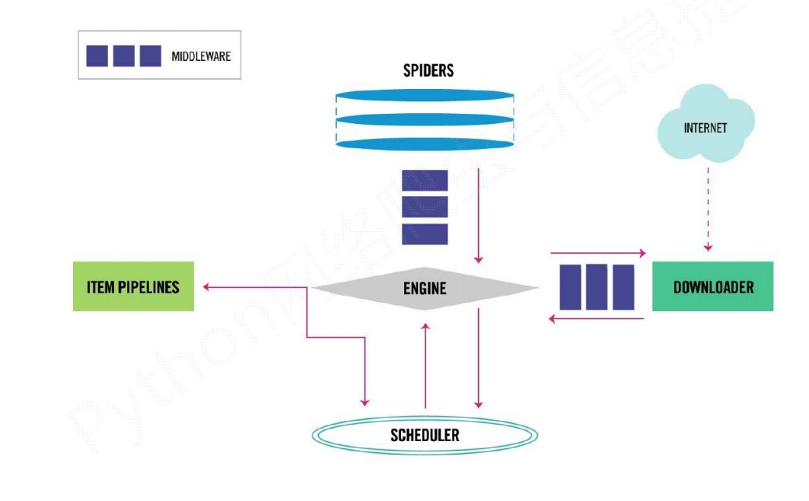
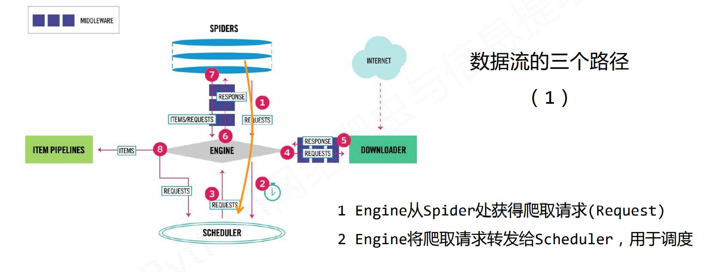
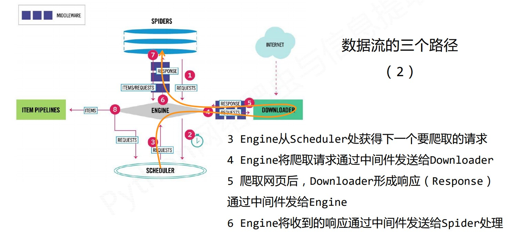
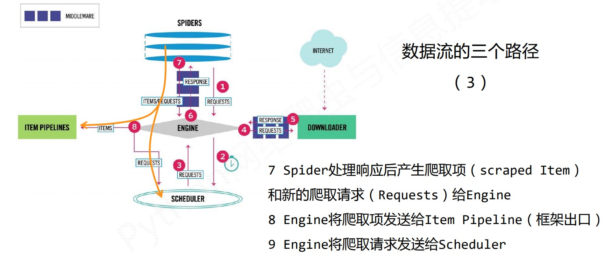
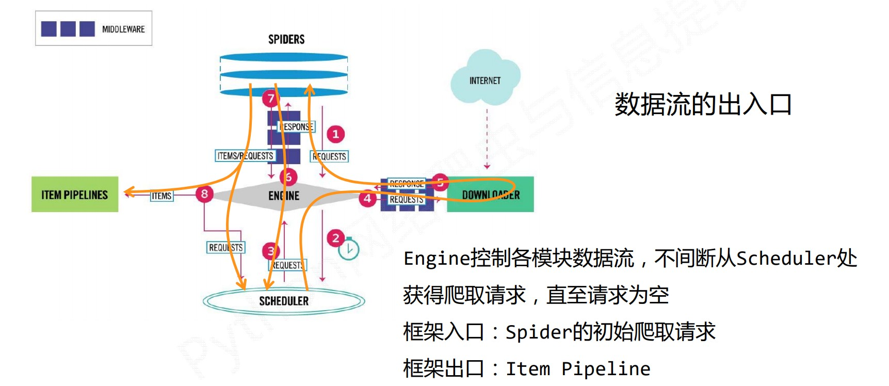

# `Scrapy`框架

## 简介

`Scrapy` 是一个快速功能强大的网络爬虫框架。

爬虫框架是实现爬虫功能的一个软件结构和功能组件集合。是一个半成品，能够帮助用户实现专业网络爬虫。


### 安装

`cmd` 命令行，执行：

```python
python -m pip install scrapy
```

安装后测试：

```python
scrapy -h
```


### 结构

#### **“5+2”结构**



#### 三条数据流路径

> - Engine从Spider处获得爬取请求（Request）。
> - Engine将爬取请求转发给Schedule，用于调度。



> - Engine从Schedule处获得下一个要爬取的请求。
> - Engine将爬取请求通过中间件发送给Downloader。
> - 爬取网页后，Downloader形成响应（Response）通过中间件发给Engine。
> - Engine将收到的响应通过中间件发送给Spider处理。



> - Spider处理响应后产生爬取项（scraped Item）和新的爬取请求（Requests）给Engine。
> - Engine将爬取项发送给Item Pipeline（框架出口）。
> - Engine将爬取请求发送给Schedule。



#### 数据流的出入口




### 解析

#### Engine

> 不需要用户修改。

- 控制所有模块之间的数据流。
- 根据条件触发事件。


#### Downloader

> 不需要用户修改。

- 根据请求下载网页。


#### Schedule

> 不需要用户修改。

- 对所有爬取请求进行调度管理。


#### Downloader Middleware

> 用户可以编写配置代码。

- 目的：实施Engine、Schedule和Downloader之间进行用户可配置的控制。
- 功能：修改、丢弃、新增请求或响应。


#### Spider

> 需要用户编写配置代码。

- 解析Downloader返回的响应（Response）
- 产生爬取项（scraped item）
- 产生额外的爬取请求（Request）


#### Item Pipelines

> 需要用户编写配置代码。

- 以流水线方式处理Spider产生的爬取项。
- 由一组操作顺序组成，类似流水线，每个操作是一个Item Pipeline类型。
- 可能操作包括：清理、检验和查重爬取项中的HTML数据、将数据存储到数据库。


#### Spider Middleware

> 用户可以编写配置代码。

- 目的：对请求和爬取项的再处理。
- 功能：修改、丢弃、新增请求或爬取项。


### `Requests`库与`Scrapy`库的比较

#### 相同点

- 两者都可以进行页面请求和爬取，Python爬虫的两个重要技术路线。
- 两者可用性都好，文档丰富，入门简单。
- 两者都没有处理`js`、提交表单、应对验证码等功能。


#### 不同点

| `Requests`库             | `Scrapy`库                 |
| ------------------------ | -------------------------- |
| 页面级爬虫               | 网站级爬虫                 |
| 功能库                   | 框架                       |
| 并发性考虑不足，性能较差 | 并发性好，性能较高         |
| 重点在于页面下载         | 重点在于爬虫结构           |
| 定制灵活                 | 一般定制灵活，深度定制困难 |
| 上手十分简单             | 入门稍难                   |


## 使用

### 常用命令

`Scrapy`是为持续运行设计的专业爬虫框架，提供操作的`Scrapy`命令行。

```python
# scrapy <command>[options][args]
```

| 命令           | 说明               | 格式                                         |
| -------------- | ------------------ | -------------------------------------------- |
| `startproject` | 创建一个新工程     | `scrapy startproject <name> [dir]`           |
| `genspider`    | 创建一个爬虫       | `scrapy genspider [options] <name> <domain>` |
| `settings`     | 获得爬虫配置信息   | `scrapy settings [options]`                  |
| `crawl`        | 运行一个爬虫       | `scrapy crawl <spider>`                      |
| `list`         | 列出工程中所有爬虫 | `scrapy list`                                |
| `shell`        | 启动URL调试命令行  | `scrapy shell [url]`                         |


### 步骤

- 步骤1：**创建一个工程和Spider模板**
- 步骤2：**编写Spider**
- 步骤3：**编写Item Pipeline**
- 步骤4：**优化配置策略**


### 数据类型

#### `Requests`类型


#### `Response`类型


#### `Item`类型


## 实例

